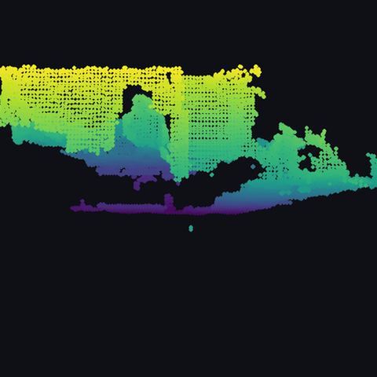
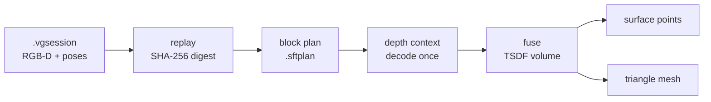

# SpatialForge

Deterministic 3D reconstruction from calibrated RGB-D scans, built for indoor
mapping. Turns a folder of depth frames and known camera poses into a metric
TSDF volume, surface points, and a mesh — reproducibly, with every step
verifiable.

<p align="center">
  
</p>

<p align="center">
  <em>14,625 surface points reconstructed from 99 frames of the TUM RGB-D<br>
  benchmark. Coloured by height: wall and boards at the top, desk surface in<br>
  the middle, floor in purple.</em>
</p>

---

## Why this exists

Most reconstruction libraries optimise for speed and quality. This one
optimises for **being able to prove the output is right**.

That constraint came from the use case: it feeds an indoor navigation system,
where a wrong wall means a person walks into it. So every stage carries its
provenance, every operation is reproducible byte-for-byte, and every fast path
is checked against a slower, simpler one that is easier to trust.

Concretely:

- **Deterministic.** The same session produces the same SHA-256 digest, every
  run, on any machine. Artifacts record the digest of the inputs that made
  them and refuse to load against a session that has changed.
- **Every optimisation has a reference.** The sparse volume is checked against
  a dense one. The vectorised evaluator is checked against a scalar one. Not
  "within tolerance" — identical bits.
- **Failures are loud.** Operations preflight before writing, roll back on
  error, and refuse rather than guess. The mesher rejecting a non-manifold
  surface is the system working.

## Results on real data

Run against [TUM RGB-D](https://cvg.cit.tum.de/data/datasets/rgbd-dataset)
`freiburg1_xyz` — a real Kinect-class sensor with motion-capture ground truth.

The honest test for reconstruction quality is cross-validation: build the
volume from one set of frames, then check it against frames it never saw. A
correct TSDF reads zero exactly where an unseen camera measured a surface, so
the interpolated value is a signed surface error.

| Metric | Value |
|---|---|
| Fused frames | 99 (30 mm voxels) |
| Held-out frames | 98, none of which contributed a voxel |
| Held-out depth samples | 1,428,048 |
| Landing inside observed voxels | **99.8%** |
| Median surface error | **9.3 mm** |
| RMS | 20.4 mm |
| p95 | 45.6 mm |

Full method, timings, and the things that broke:
[`docs/tum-validation.md`](docs/tum-validation.md).

## Install

Python 3.11+ and NumPy. No GPU, no CUDA, no build step.

```bash
python -m venv .venv
.venv/Scripts/python.exe -m pip install -e .
```

## Quickstart

Reconstruct the committed test fixture end to end:

```bash
python -m spatialforge scan validate tests/fixtures/minimal.vgsession
```

```bash
python -m spatialforge reconstruct tsdf-auto \
  tests/fixtures/minimal.vgsession outputs/scene.sftsdf \
  --voxel-size-m 0.05 --truncation-m 0.15
```

```bash
python -m spatialforge reconstruct triangle-mesh \
  outputs/scene.sftsdf outputs/scene.ply
```

Every command prints `key: value` diagnostics, one fact per line, including
explicit negatives so you can see what it did *not* do:

```text
TSDF BLOCK CONTEXT BLOCK FUSION CHECK scan-synthetic-0001
block: index=(1, -1, -1) row=1 resolution=8 voxel_slots=512
fusion_path: vectorised-field-per-observation
contributions_evaluated: 1024
contributions_applied: 204
scalar_reference_parity: byte-identical
artifact_written: no
storage_persisted: no
```

## Run it on real data

```bash
# 1. Import a TUM RGB-D sequence into the session format
python -m spatialforge scan import-tum \
  datasets/rgbd_dataset_freiburg1_xyz datasets/fr1xyz.vgsession
```

```bash
# 2. Plan which voxel blocks the depth actually reaches
python -m spatialforge reconstruct tsdf-block-plan \
  datasets/fr1xyz.vgsession datasets/fr1xyz.sftplan \
  --voxel-size-m 0.03 --truncation-m 0.09 --frame-stride 8
```

```bash
# 3. Fuse it and score against held-out frames
python tools/tum_reconstruction_report.py \
  datasets/fr1xyz.vgsession datasets/fr1xyz.sftplan
```

```bash
# 4. Render the result
python tools/render_point_cloud.py scene.ply docs/assets/scene
```

## How it works



**Session and replay.** A `.vgsession` is a folder of RGB, depth, IMU and pose
streams with a manifest. Replay associates them by exact timestamp and hashes
every input file into one digest that identifies the scan.

**Block planning.** Rather than allocating a dense grid over the whole scene,
the planner walks the depth samples and selects only the 8×8×8 voxel blocks
the surfaces actually reach, plus a truncation halo. On the TUM scene this is
635k voxel slots where a dense grid would need 2.75M.

**Depth context.** Decoding the same depth frame once per voxel is the obvious
trap. The context decodes each frame exactly once into immutable storage, and
everything downstream reads from it — no file I/O, no hashing, no decoding in
the hot path.

**Fusion.** For each block, each observation is evaluated as a whole-block
field — 512 voxels projected, sampled and classified in one NumPy pass — and
the fields are applied in canonical observation order.

**Extraction.** Sign-changing edges become surface points; fully observed
cells become triangles via a fixed six-tetrahedron split.

## The interesting problem: making it fast without changing the answer

The sparse path started ~100× slower than the dense one it was meant to
replace, because it looped in Python. Vectorising it took a small room scan
from **210 s to 2 s**.

The constraint was that the fast path had to be **byte-identical** to the slow
one — and that is harder than it sounds, because floating-point addition is
not associative:

```text
(a + b) + c  ≠  a + (b + c)      in the last bits
```

Any reordering silently changes the reconstruction. So:

- The world-to-camera product is written out term by term instead of as a
  matrix multiply, because a matrix multiply is free to reassociate or fuse
  the multiply-add.
- `fx * x / z + cx` stays left-associated.
- Voxels that fail an early gate still ride through the later arithmetic (that
  is what makes it one pass); their garbage is silenced with `errstate` and
  their pixel indices pinned in bounds so the depth gather stays valid.
- Skipped voxels carry `+0.0`, which is bit-preserving, so no masking is
  needed when the fields are summed.

Details: [`docs/tsdf-block-contributions.md`](docs/tsdf-block-contributions.md)
and [`docs/tsdf-block-vector-fusion.md`](docs/tsdf-block-vector-fusion.md).

## What it does not do

Stated plainly, because the gaps matter more than the features:

- **No pose estimation.** Poses must be supplied. There is no SLAM, no visual
  odometry, no bundle adjustment. It cannot take a raw phone video.
- **No relocalization.** It builds maps; it does not position anyone inside
  one.
- **No semantics.** It produces geometry, not rooms, doors or accessibility.
- **Planning is slow.** ~2 s per 640×480 frame; it is a per-pixel Python loop
  and is currently the pipeline bottleneck.
- **Sequence length is capped.** The depth context holds float64 depth against
  a 512 MB ceiling — about 208 frames at 640×480.
- **Meshing fails on real data.** The fixed six-tetrahedron split produces
  non-manifold vertices on real geometry and the validator rejects it. Surface
  points extract fine from the same volume.
- **Volumes are in memory.** Fusion resumes within a process, not across runs.

## Layout

```text
spatialforge/     library and CLI
  replay.py         deterministic session replay and digests
  tsdf.py           dense reference integrator
  tsdf_block_*.py   sparse block planning, storage, fusion
  surface.py        zero-crossing surface points
  mesh.py           triangle extraction
  tum_importer.py   TUM RGB-D → session format
tools/            reproducible analysis and rendering scripts
tests/            38 test modules, 434 tests
docs/             format specs, algorithm notes, validation reports
```

## Development

```bash
.venv/Scripts/python.exe -W error -m unittest discover -s tests -p "test_*.py"
```

434 tests, about 80 seconds, must finish `OK`. Warnings are errors. Tests
assert no filesystem changes and patch functions an operation must not call,
then assert they were never reached.

## Status and licence

Working prototype, actively developed. The known-pose reconstruction path is
complete and validated on real sensor data; pose estimation, localization and
semantics are not started. See [`docs/roadmap.md`](docs/roadmap.md).

Built as the reconstruction backend for an indoor navigation project.
