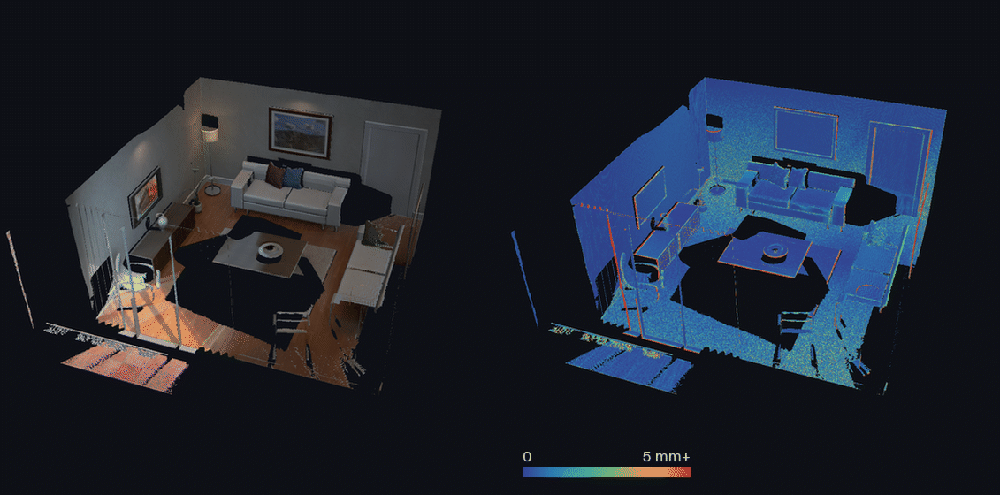
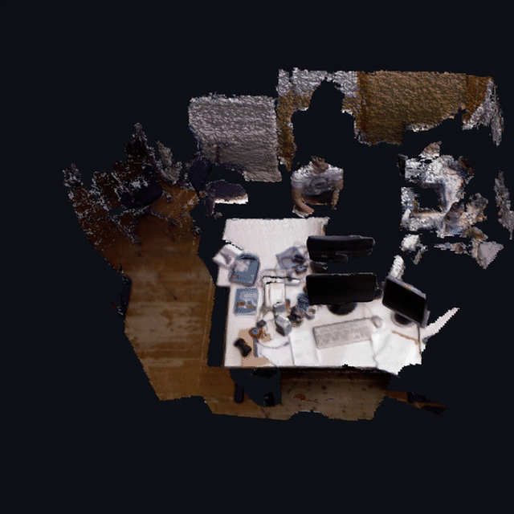
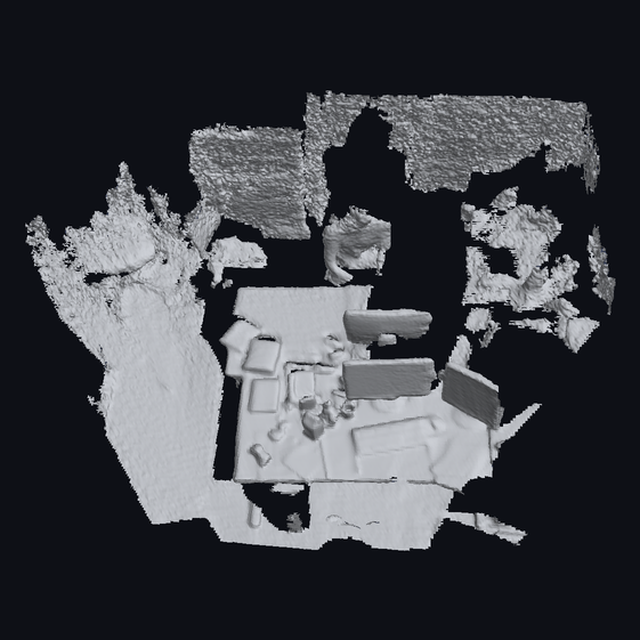
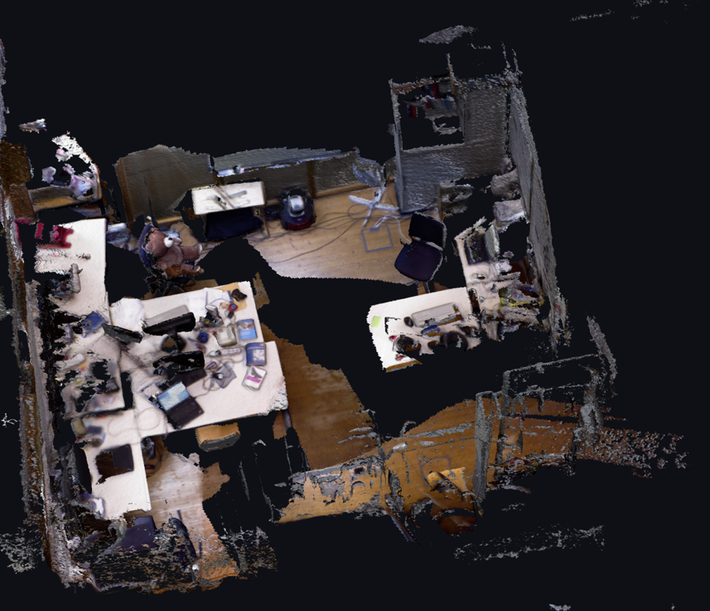
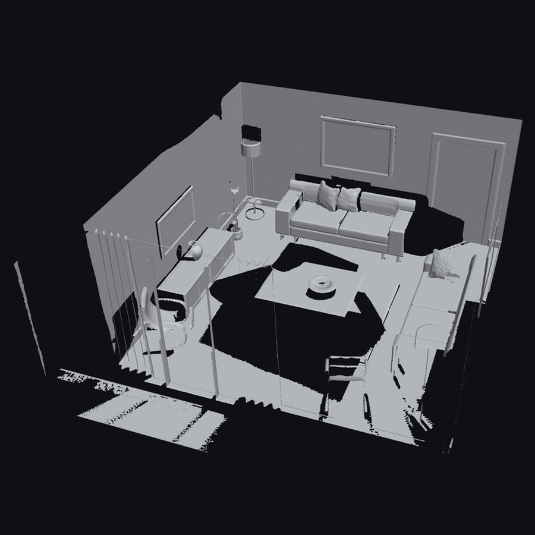
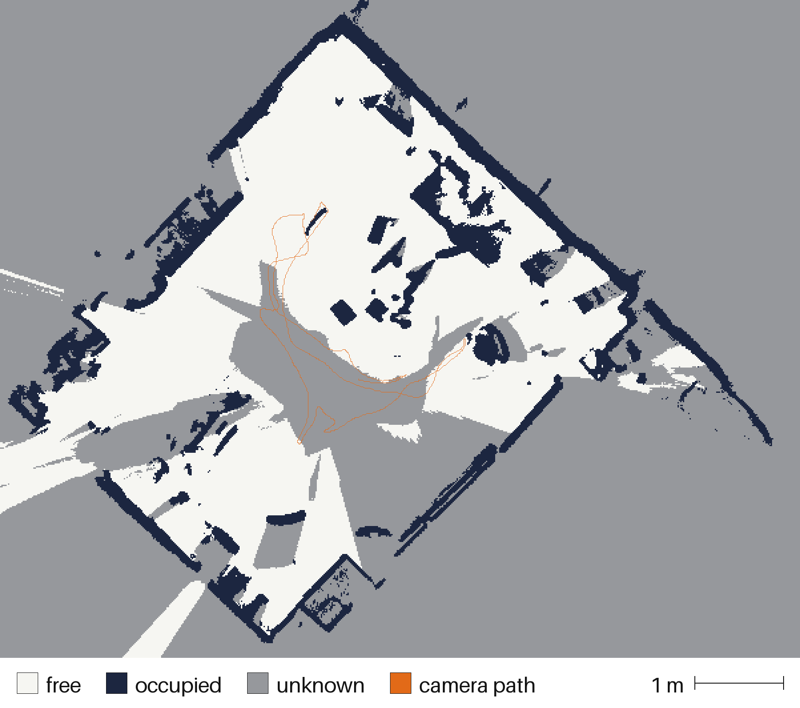
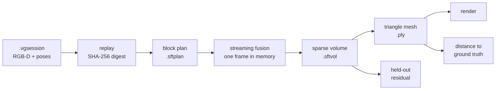

# SpatialForge

[](https://github.com/SanishKumar/Spatial_Forge/actions/workflows/tests.yml)

Deterministic 3D reconstruction from calibrated RGB-D scans, built for indoor
mapping. Turns a folder of depth frames and known camera poses into a sparse
metric TSDF volume and a triangle mesh — reproducibly, bit for bit, with every
fast path proven identical to a slower one that is easier to trust.

<p align="center">
  
</p>

<p align="center">
  <em>A living room reconstructed at 10 mm from 440 depth frames: 7.2
  million triangles. Left, coloured from the scan.<br>Right, the same mesh
  coloured by its measured distance from the ground-truth surface, on a
  scale that stops at 5 mm.<br>Half of it is within 0.45 mm. The scene is
  ICL-NUIM's, synthetic and with exact poses; a real sensor is further
  down.</em>
</p>

| | |
|---|---|
| Against a known surface | **0.45 mm** median, 0.77 mm mean distance to ground truth at 10 mm voxels; 0.48 mm and 0.77 mm on a second path through the same room ([ICL-NUIM](#against-a-known-surface), synthetic depth, exact poses) |
| With a Kinect's noise simulated | **0.86 mm** median to ground truth at 10 mm voxels, from depth frames a median 3.2 mm off |
| How much of what was seen | **98.4%** of the observed ground-truth surface has mesh within 20 mm, 93.3% within 5 mm; 96% of what is missing was only ever seen at a glancing angle |
| On a real depth camera | **7.5 mm** median residual against frames never fused, at 15 mm voxels, on a desk; 10.5 mm round a [whole office](#a-whole-room), and 6 mm in either within a metre of the camera ([TUM RGB-D](#results-on-real-data)) |
| Free space | the voxel at each of the 880 camera positions is observed free in the [expanded volume](#where-there-is-room); adding it changes no triangle of the 20 mm mesh, and adds 118 to 7.2 million at 10 mm. A real office gets a floor plan: 16.3 m² observed free above its desks |
| Reproducible | the committed scan reconstructs to the same bytes on Linux, macOS and Windows, under Python 3.11 and 3.14, checked on every push |
| Cost | one CPU core and NumPy: 6.3 billion voxel-observations fused in 211 s |

---

## Why this exists

Most reconstruction libraries optimise for speed and quality. This one
optimises for **being able to prove the output is right**.

That constraint came from the use case: it feeds an indoor navigation system,
where a wrong wall means a person walks into it. So every stage carries its
provenance, every operation is reproducible byte for byte, and every fast path
is checked against a slower, simpler one.

- **Deterministic.** The same scan produces the same bytes. Every artifact
  records the digest of what it was made from and refuses to load against
  anything else.
- **Every optimisation has a reference.** The vectorised planner writes the
  same plan file as the per-pixel one. Vectorised fusion leaves the same
  accumulator bytes as the per-voxel one. The sparse mesher emits the same
  vertices and triangles as the dense one. Not "within tolerance" — identical.
- **Failures are loud.** Operations preflight before writing, roll back on
  error, and refuse rather than guess.

None of the underlying algorithms are new; see
[where this sits](#where-this-sits). What is unusual is the standard of
evidence.

## Results on real data

[TUM RGB-D](https://cvg.cit.tum.de/data/datasets/rgbd-dataset)
`freiburg1_xyz`: a real Kinect-class sensor with motion-capture poses. Every
second frame is fused; the frames in between are held out and never
contribute a voxel.

| | |
|---|---|
| Voxel size / truncation | 15 mm / 45 mm |
| Frames fused | 395 |
| Voxel-observations evaluated | 1,095,063,552 |
| Observed voxels | 1,492,894 in 5,401 sparse blocks |
| Mesh | 279,979 vertices, 535,486 triangles |
| Held-out frames | 395, none of which contributed |
| Held-out depth samples | 5,757,844 |
| Landing inside observed voxels | **99.95%** |
| Median held-out TSDF residual | **7.5 mm** |
| RMS / p95 | 13.4 mm / 28.8 mm |

**Read that number carefully.** A correct TSDF reads zero exactly where a
camera measures a surface, so this is how far the volume disagrees with depth
from viewpoints it never saw. It is not distance to a surveyed surface, and it
uses ground-truth poses throughout, so it says nothing about pose estimation.
It bounds disagreement between views, not absolute correctness.

<p align="center">
  
  
</p>

<p align="center">
  <em>The desk at 15 mm, 535,486 triangles, from 395 frames of a real
  depth camera. Left: each vertex coloured<br>only by RGB frames that
  actually see it. Right: the geometry alone. This is the measured
  volume: the numbers<br>above and this mesh come from the same file,
  tied together by digest.</em>
</p>

On one laptop CPU core, with NumPy and no GPU:

| Stage | Time |
|---|---|
| Plan sparse blocks (396 frames) | 44 s |
| Fuse 1.1 billion voxel-observations | 79 s |
| Extract the mesh | 2.5 s |
| Score against 395 held-out frames | 12 s |

The whole chain is recorded in
[`results/tum-freiburg1-xyz-15mm.json`](results/tum-freiburg1-xyz-15mm.json):
the scan, plan, volume and mesh digests, the commit that produced them, and
whether the working tree was clean. The method, the earlier 30 mm run it
supersedes, and everything this does not prove are in
[`docs/tum-validation.md`](docs/tum-validation.md).

### A whole room

`freiburg1_room` is the same sensor carried once round the whole office:
676 frames fused at 15 mm into 41,318 blocks and 3.5 million triangles.

<p align="center">
  
</p>

<p align="center">
  <em>The office at 15 mm from 676 frames of a real depth camera, seen
  from above and cropped to the room.<br>The gaps in the floor are real:
  the camera went round once, looking at the desks and the walls.</em>
</p>

| | Desk | Whole room |
|---|---|---|
| Frames fused | 395 | 676 |
| Sparse blocks | 5,401 | 41,318 |
| Mesh triangles | 535,486 | 3,502,836 |
| Held-out samples inside observed voxels | 99.95% | 99.84% |
| Median held-out residual | 7.5 mm | **10.5 mm** |
| The same, for samples within a metre | 6.1 mm | 6.4 mm |

Most of the difference is distance. Half the desk's held-out samples are
within a metre of the camera and a fifth of the room's are, and at that
range the two read alike. The residual climbs with range in both, as this
sensor's noise does.

The room was also reconstructed twice, on grids 41 degrees apart: once in
the frame of the first camera, which was looking down at a desk, and once
level. The two share no voxel and agree on the residual to a hundredth of
a millimetre, 10.49 mm in both.

## Against a known surface

The TUM number is agreement between views. It cannot say how far the
surface is from the truth, because TUM does not publish the truth.
[ICL-NUIM](https://www.doc.ic.ac.uk/~ahanda/VaFRIC/iclnuim.html) does: a
synthetic living room, rendered from a model that ships with the dataset.

<p align="center">
  
  
</p>

<p align="center">
  <em>Left: the geometry alone at 10 mm voxels, 7.2 million triangles.
  Right: the same mesh coloured by its<br>distance to the ground-truth
  surface. The scale saturates at 5 mm; 95% of the surface is under
  2.4 mm.</em>
</p>

Distance from every mesh vertex to the true surface, sequence `lr kt2`, 440
frames fused:

| Voxel | Median | Mean | RMS | p95 | Within 10 mm |
|---|---|---|---|---|---|
| 20 mm | 0.48 mm | 1.37 mm | 4.15 mm | 4.45 mm | 97.2% |
| 15 mm | 0.45 mm | 1.02 mm | 2.87 mm | 3.20 mm | 98.3% |
| 10 mm | **0.45 mm** | **0.77 mm** | **1.69 mm** | 2.34 mm | 99.2% |
| raw depth, the floor | 0.43 mm | 0.57 mm | 0.83 mm | 1.56 mm | 99.9% |

The last row is the dataset's own depth images measured the same way: what
a perfect reconstruction would score. At the median the mesh is already
there. What separates them is the tail, and the picture shows where the
tail lives: on silhouette edges narrower than the truncation band, not on
walls.

**Read this one carefully too.** Poses are the dataset's and the depth has
no sensor noise, so this is the error the engine adds to perfect input: a
floor under any real result, not a forecast of one. It is not comparable
with numbers published for SLAM systems on this dataset, which include
tracking drift.

Three things make the figure worth having:

- **The alignment is not fitted to the answer.** The dataset publishes its
  trajectory and its model in different frames. Its own tool aligns the
  reconstruction to the model with ICP, which lets the alignment absorb
  error. Here one rigid motion is fitted to the raw depth images, and the
  mesh is judged in a frame it had no part in choosing. A test moves a mesh
  25 mm and requires the score to get worse. Where the fit starts can be
  found as well, from the room's own planes; started that way or from a
  translation given by hand, it arrives at the same alignment.
- **The handedness is converted, not ignored.** ICL-NUIM publishes
  `fy = -480`. Dropping the sign reconstructs a mirror-image room without a
  single error. The importer refuses it; a converter rewrites the poses.
- **It checks the other number.** On this dataset the held-out residual and
  the true error exist for the same volume: 1.50 mm against 1.69 mm RMS at
  10 mm, 3.63 against 4.15 at 20 mm. On exact depth the cross-view figure
  TUM is limited to runs at 87 to 89% of the real one on this path and at
  72 to 83% on a second. With sensor noise it does something else
  entirely; see below.

One path cannot say whether its figures are the engine's or the path's, so
the dataset's other trajectory through this room, `lr kt1`, went through
the same commands. Its poses are anchored 1.5 m from the first's, and the
report places it with no starting guess:

| 10 mm voxels | Median | Mean | RMS | p95 | Within 10 mm |
|---|---|---|---|---|---|
| `lr kt2`, 440 frames | 0.45 mm | 0.77 mm | 1.69 mm | 2.34 mm | 99.2% |
| `lr kt1`, 483 frames | 0.48 mm | 0.77 mm | 1.57 mm | 2.20 mm | 99.2% |

### With a sensor's noise

The same sequence again, with a Kinect's depth noise simulated on it: the
model the ICL-NUIM paper describes, drawn from a seed, not the dataset's own
noisy files. Same scene, poses, ground truth and frame; only the depth is
worse.

| | Median | Mean | RMS | p95 |
|---|---|---|---|---|
| one noisy depth frame | 3.16 mm | 5.28 mm | 8.97 mm | 16.91 mm |
| mesh from noisy depth, 20 mm voxels | 0.81 mm | 1.89 mm | 4.87 mm | 5.92 mm |
| mesh from noisy depth, 15 mm voxels | 0.77 mm | 1.63 mm | 3.82 mm | 5.02 mm |
| mesh from noisy depth, 10 mm voxels | **0.86 mm** | **1.55 mm** | **3.00 mm** | 4.87 mm |
| mesh from exact depth, 10 mm voxels | 0.45 mm | 0.77 mm | 1.69 mm | 2.34 mm |

Fusing 440 noisy frames gives a surface 3.7 times closer to the truth than
a single one of them is, at the median, and 0.4 mm worse than exact depth
gives. With noise the median stops improving with voxel size: what is left
is the sensor's, not the grid's.

It also changes how the TUM number should be read. Under this noise the
held-out residual is 4.5 mm at the median while the mesh is 0.86 mm from
the truth. The residual compares the volume with held-out frames, and
those carry the noise in full. On a real sensor it mostly measures the
sensor.

The dataset also publishes this sequence with its own noise applied, and
that is a different thing. Its depth is quantised as the paper says, but it
sits half a disparity level nearer the camera than the exact depth, in
every frame: 3 mm at 1.2 m, 17 mm at 3.5 m. The paper's equation, simulated
above, leaves no such offset.

| | Median | Mean signed |
|---|---|---|
| one frame of the dataset's noisy depth | 7.66 mm | +9.64 mm |
| mesh from it, 15 mm voxels | **9.27 mm** | **+9.82 mm** |
| mesh from simulated noise, 15 mm voxels | 0.77 mm | +0.27 mm |

Averaging removes noise and cannot remove an offset. The mesh ends up
10 mm on the camera's side of the truth, no better than a single frame, and
the held-out residual does not notice: frames that are all wrong the same
way agree with each other. Between them the three cases put the residual at
0.8, 6 and 0.8 times the true error, so nothing converts one into the
other.

The dataset's noisy files for the second trajectory are the same half
level out, +0.48, and do the same thing: a frame is 7.3 mm from the truth
at the median and the mesh fused from 483 of them is 7.4 mm from it,
sitting a mean 6.8 mm on the camera's side.

### How much of it is there

Accuracy says the surface that was built is in the right place. It would
say the same of one well-placed square metre of wall. So the model is asked
the other way round: of the true surface that at least three fused frames
saw, how much has mesh nearby?

| Seen surface, 10 mm voxels | Within 5 mm | Within 20 mm | None within 30 mm |
|---|---|---|---|
| exact depth | 93.3% | 98.4% | 1.1% |
| simulated Kinect noise | 91.4% | 98.6% | 0.9% |
| exact depth, where some frame looked within 70.5° of head-on | **95.3%** | **99.7%** | **0.05%** |
| exact depth, where every frame only glanced along it | 76.8% | 87.4% | 9.9% |

Noise costs almost no coverage. What is missing is one kind of surface: a
tenth of what was seen was never viewed within 70.5° of head-on, and it
holds 96% of what the mesh lacks. The fusion rule predicts the angle. A
projective distance reaches about `truncation × cos θ` behind a surface
seen at θ from its normal, and with a band of three voxels that drops
under one voxel at 70.5°. Past it a plane can fall between voxel centres
and leave no sign change to mesh. The loss in the measurements starts
between 70° and 75°.

Widening the band tests that, and it holds: the loss moves out to the
angle each width predicts. At 10 mm, six voxels of truncation in place of
three cut the missing surface from 1.1% to 0.2%, and raise the RMS error
from 1.7 mm to 4.5 mm while the median barely moves, 0.45 mm to 0.46 mm.
Three voxels, used for every figure above, is a choice that favours
accuracy.

The second trajectory loses the same surface for the same reason. Its
10 mm mesh has 99.0% of what was seen within 20 mm, and of the 2,033
points with nothing within 30 mm, all but ten were only ever glanced at.

Method, the three undocumented conventions of the dataset, and everything
this does not show: [`docs/icl-nuim-validation.md`](docs/icl-nuim-validation.md).

## Where there is room

A mesh says where surfaces are. A map for moving through a place also has
to say where there is nothing, and to tell that from where nobody looked.
Expanding a plan adds every block that holds a voxel some frame observed:
the space between the cameras and the surfaces.

<p align="center">
  
</p>

<p align="center">
  <em>The living room between 0.28 m and 0.86 m above its floor, from the
  expanded volume at 20 mm.<br>Pale is observed free, dark is occupied,
  grey is unknown. The orange line is the camera's path.</em>
</p>

| Living room, 20 mm | Surface plan | Expanded |
|---|---|---|
| Blocks | 7,655 | 17,394 |
| Mesh | 1,796,756 triangles | the same triangles, byte for byte |
| Free floor area in the band | 2.05 m² | **14.33 m²** |
| Camera positions in observed free space | 0 of 880 | **880 of 880** |

The last row is a check the scan makes on itself. No camera position is
used to mark anything free; free space comes only from depth rays. Yet the
voxel at every one of the 880 places a camera stood is one that other
frames looked through. On the real Kinect sequence the same check finds
476 of 790 positions in observed free space, 314 unseen, and none behind
a surface, and there too the mesh is unchanged.

The real office from further up, the same way:

<p align="center">
  
</p>

<p align="center">
  <em>The office between 0.80 m and 1.40 m above its floor, from 676
  frames of a real depth camera at 15 mm.<br>The grey in the middle is
  where the person carrying the camera stood: it was behind the camera in
  every frame.</em>
</p>

| Real office, 15 mm | Surface plan | Expanded |
|---|---|---|
| Blocks | 41,318 | 69,415 |
| Mesh | 3,502,836 triangles | the same triangles |
| Free area in the band | 3.83 m² | **16.32 m²** |
| Camera positions in observed free space | 125 of 1,352 | 558 of 1,352 |
| Camera positions behind a surface | 0 | 0 |

It is a floor plan of the room above its desks and it is not more than
that. The band is the one this scan covers. Over the height of someone
standing, 0.10 m to 1.80 m, three and a half square metres are known free:
the camera was pointed at desks and walls and never at the floor between
them, and a column with one unobserved voxel is unknown. The map answers
with grey where it should.

What is observed is decided by the fusion code itself, run over a box of
candidate blocks whose size is derived, and checked against a second
implementation: [`docs/free-space-expansion.md`](docs/free-space-expansion.md).

## The same bytes everywhere

Reproducibility here is a tested property, not an intention. The committed
fixture reconstructs to a volume and a mesh whose SHA-256 digests are written
literally into the test suite, and CI runs that suite on Linux, macOS and
Windows under Python 3.11 and 3.14. They only pass if all six agree.

You can check it on your own machine in three commands — see below.

## Install

Python 3.11+ with NumPy and Pillow. No GPU, no compiler, no build step.

```bash
python -m venv .venv
.venv/Scripts/python.exe -m pip install -e .
```

## Quickstart

Reconstruct the committed test fixture end to end:

```bash
python -m spatialforge reconstruct tsdf-block-plan \
  tests/fixtures/minimal.vgsession outputs/demo.sftplan \
  --voxel-size-m 0.125 --truncation-m 0.5
```

```bash
python -m spatialforge reconstruct tsdf-block-volume \
  outputs/demo.sftplan tests/fixtures/minimal.vgsession outputs/demo.sftvol
```

```bash
python -m spatialforge reconstruct tsdf-block-volume-mesh \
  outputs/demo.sftvol outputs/demo.ply
```

Each prints the digest of what it wrote. Whatever machine you are on, the
volume and the mesh should be:

```text
output_sha256: 29f9f427b43c2a9e8ec416dad9a3ba1572044c716407ef2b30989daed9c2adc3
output_sha256: 8c019fe39e181ef1855c8c229422528cf4218ca5b4998af533ae5e00d4e5f190
```

Every command prints `key: value` diagnostics, one fact per line, including
explicit negatives so you can see what it did *not* do.

## Run it on real data

Download and extract a
[TUM RGB-D sequence](https://cvg.cit.tum.de/data/datasets/rgbd-dataset/download),
then:

```bash
# 1. Import it into the session format. Add --up z for a level session,
#    which a floor plan needs and a mesh does not
python -m spatialforge scan import-tum \
  datasets/rgbd_dataset_freiburg1_xyz datasets/fr1xyz.vgsession
```

```bash
# 2. Plan which voxel blocks the depth actually reaches
python -m spatialforge reconstruct tsdf-block-plan \
  datasets/fr1xyz.vgsession datasets/fr1xyz.sftplan \
  --voxel-size-m 0.015 --truncation-m 0.045 --frame-stride 2
```

```bash
# 3. Fuse, one frame at a time, into a persisted sparse volume
python -m spatialforge reconstruct tsdf-block-volume \
  datasets/fr1xyz.sftplan datasets/fr1xyz.vgsession datasets/fr1xyz.sftvol
```

```bash
# 4. Mesh the volume
python -m spatialforge reconstruct tsdf-block-volume-mesh \
  datasets/fr1xyz.sftvol datasets/fr1xyz.ply \
  --min-weight 3 --min-component-triangles 200
```

```bash
# 5. Score the volume against the frames it never saw
python tools/tum_reconstruction_report.py \
  datasets/fr1xyz.vgsession datasets/fr1xyz.sftvol --mesh datasets/fr1xyz.ply
```

```bash
# 6. Render it
python tools/render_mesh.py datasets/fr1xyz.ply datasets/fr1xyz-render \
  --session datasets/fr1xyz.vgsession --azimuth 190 --elevation 12 --sweep 28
```

Step 5 refuses a mesh that was not extracted from the volume it is scoring,
so the picture cannot quietly be of something else.

Step 3 is the long one. Add `--checkpoint datasets/fr1xyz.sftckpt` and, if
it is interrupted, running the same command again continues from the last
save and writes the same volume.

To keep observed free space as well as surfaces, expand the plan between
steps 2 and 3 and fuse the expanded one:

```bash
python -m spatialforge reconstruct tsdf-block-plan-expand \
  datasets/fr1xyz.sftplan datasets/fr1xyz.vgsession \
  datasets/fr1xyz-free.sftplan
```

## How it works



**Session and replay.** A `.vgsession` is a folder of RGB, depth, IMU and pose
streams with a manifest. Replay associates them by exact timestamp and hashes
every input file into one digest that identifies the scan.

**Block planning.** Rather than allocating a dense grid over the whole scene,
the planner selects only the 8×8×8 voxel blocks that surfaces reach, plus a
truncation halo. On the TUM scene that is 2.8 million voxel slots where a
dense grid over the same bounds would need about 38 million.

**Streaming fusion.** Each frame is decoded once, every planned voxel is
projected, sampled and classified against it in NumPy, the result is added,
and the frame is dropped. Memory is one depth image however long the scan is.

**Persisted volume.** The fused sums and weights are written as a `.sftvol`:
a canonical JSON header and fixed little-endian arrays, with a digest per
array. The loader re-derives every count the header claims from the payload
and refuses a file where they disagree.

**Meshing.** Every fully observed cell is split into six tetrahedra and
triangulated, vectorised over all cells at once.

## Three problems worth describing

### Making it fast without changing the answer

The sparse path started about 100× slower than the dense one it was meant to
replace, because it looped in Python. Vectorising it took a small room scan
from **210 s to under a second**.

The constraint was that the fast path had to be **byte-identical** to the slow
one, and that is harder than it sounds, because floating-point addition is not
associative:

```text
(a + b) + c  ≠  a + (b + c)      in the last bits
```

Any reordering silently changes the reconstruction. So the world-to-camera
product is written out term by term instead of as a matrix multiply, which is
free to reassociate or fuse its multiply-add; `fx * x / z + cx` stays
left-associated; and voxels that fail an early gate still ride through the
later arithmetic, their garbage silenced and their pixel indices pinned in
bounds, because that is what makes it one pass.

### Fusing a long scan without holding it

The first real-data run could use 99 of 792 frames: decoded depth for every
frame was held at once and ran out of room.

Fusion never needed the frames together. A voxel's value is a sum over
observations in order, so frames can be consumed one after another. Walking
frames in the outer loop instead of blocks changes *which voxel is visited
when*, never *the order in which one voxel receives its contributions* — and
that order is the only thing that fixes the last bits. So the streaming path
is byte-identical to the block-by-block one by construction, and all 790
posed frames now fuse in 42 s at 30 mm.

The same argument lets a fusion stop. Cut between two frames and no voxel
is interrupted part way through its additions, so `--checkpoint` saves the
accumulators as it goes and a run that is interrupted can be run again. The
living room's 20 mm fusion was killed 80 frames in and restarted; the volume
it wrote has the digest of the published one. See
[`docs/fusion-checkpoint.md`](docs/fusion-checkpoint.md).

### Meshing data that is not tidy

The reference mesher refused the first real volume outright: non-manifold
vertices.

Real scans have ragged observed regions. Around a grid edge, the cells on two
opposite sides can be observed while the cells between them are not, so two
separate fans of triangles meet at a single vertex — a pinch. That is not an
error in the data. Each fan now gets its own copy of the vertex, which is the
standard repair, and the *reference mesher's own* topology check is then run
on the result to confirm it is a surface the reference would have accepted.
The TUM volume has 31 of them in 535,486 triangles.

Details: [`docs/vectorised-fusion.md`](docs/vectorised-fusion.md),
[`docs/sparse-volume-format.md`](docs/sparse-volume-format.md) and
[`docs/sparse-meshing.md`](docs/sparse-meshing.md).

## What it does not do

Stated plainly, because the gaps matter more than the features:

- **No pose estimation.** Poses must be supplied. There is no SLAM, no visual
  odometry, no bundle adjustment. It cannot take a raw phone video.
- **No relocalization.** It builds maps; it does not position anyone inside
  one.
- **No semantics.** It produces geometry, not rooms, doors or accessibility.
- **No absolute accuracy on a real sensor.** The ground-truth comparison is
  on synthetic depth, exact or with simulated noise. On real data there is
  only the held-out residual, which is agreement between views: a
  reconstruction wrong the same way from every viewpoint would still score
  well. Closing that needs a surveyed real scene.
- **Surface only glanced at is lost.** Signed distance is projective and
  every observation weighs the same. A surface no frame saw within about
  70° of head-on can fall between voxel centres, such as a table top seen
  from across a room: between 7% and 23% of such surface is missing from
  the ICL-NUIM meshes. A wider truncation band brings most of it back and
  costs accuracy at edges; a distance measured along the surface normal
  would avoid that trade and is not implemented.
- **Not real time.** Fourteen to thirty million voxel-observations per
  second on one CPU core, depending on how much of the scene each frame
  can see. A GPU system does this live; this one takes minutes.
- **A size ceiling.** A plan is limited to 250,000 blocks: 128 million
  voxels, 1.5 GB of accumulators held in memory. A scene that needs more
  is refused with a message saying so.
- **A volume cannot be extended.** A plan is made from a fixed set of
  frames. An interrupted fusion can be continued to the same bytes, but
  frames from outside the plan cannot be added: new frames mean a new
  plan and a new fusion.
- **Free space is observed emptiness, not a route.** The expanded volume
  says where the scan looked and found nothing. It does not find the
  floor, know the size of whoever is moving, or plan a path, and a
  column with one unobserved voxel is unknown. A scan that never looks
  down leaves the floor unknown, and the real office's map shows it.
- **Free space is slow to plan.** Expanding the office's plan took 27
  minutes where fusing it took under eight, and unlike fusion it cannot
  be continued after an interruption.

## Where this sits

Truncated signed distance fusion is
[Curless and Levoy, 1996](https://graphics.stanford.edu/papers/volrange/);
doing it live on a depth camera is
[KinectFusion, 2011](https://doi.org/10.1109/ISMAR.2011.6092378);
storing it in sparse hashed blocks is
[Nießner et al., 2013](https://niessnerlab.org/projects/niessner2013hashing.html).
[InfiniTAM](https://arxiv.org/abs/1410.0925),
[voxblox](https://arxiv.org/abs/1611.03631),
[VDBFusion](https://pmc.ncbi.nlm.nih.gov/articles/PMC8838740/),
[nvblox](https://arxiv.org/abs/2311.00626) and Open3D are mature, much faster
implementations. Nothing here is a new capability, and if you need a
reconstruction, use one of those.

What those systems do not try to be is bit-reproducible. A real-time GPU
pipeline is built to tolerate small inconsistencies in exchange for speed —
InfiniTAM, for instance, allocates blocks with non-atomic writes and accepts
that a hash collision within a frame is simply corrected in the next. That is
the right trade for a robot. This project makes the opposite one: slower, and
able to say exactly which bytes a given scan must produce.

More in [`docs/related-work.md`](docs/related-work.md).

## Layout

```text
spatialforge/     library and CLI
  replay.py               deterministic session replay and digests
  tsdf_block_plan.py      sparse block planning
  tsdf_stream_fusion.py   frame-at-a-time fusion
  tsdf_block_volume.py    the .sftvol format
  tsdf_fusion_checkpoint.py  a fusion saved part way, to continue
  tsdf_stream_expansion.py   observed free space, at real scale
  tsdf_block_mesh.py      sparse meshing
  tsdf.py, mesh.py        dense reference integrator and mesher
  tum_importer.py         TUM RGB-D -> session format
tools/            reproducible scoring and rendering scripts
tests/            59 test modules
results/          generated result manifests, one per published run
docs/             format specs, algorithm notes, validation reports
```

## Development

```bash
.venv/Scripts/python.exe -W error -m unittest discover -s tests -p "test_*.py"
```

Warnings are errors. Tests assert that operations leave the filesystem alone
and patch functions an operation must not call, then assert they were never
reached.

## Status

A research-grade known-pose reconstruction pipeline, complete from scan to
mesh, validated on real sensor data and measured against a ground-truth
surface for accuracy and for completeness. Pose estimation, localization
and semantic mapping are outside it.
Built as the reconstruction backend for an indoor navigation project.

What changed in each version: [`CHANGELOG.md`](CHANGELOG.md).
