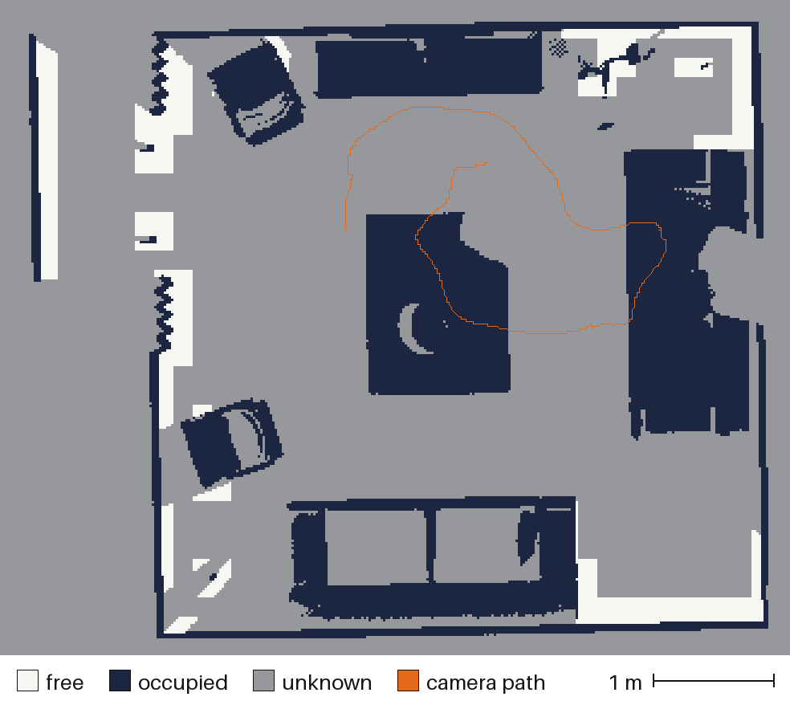
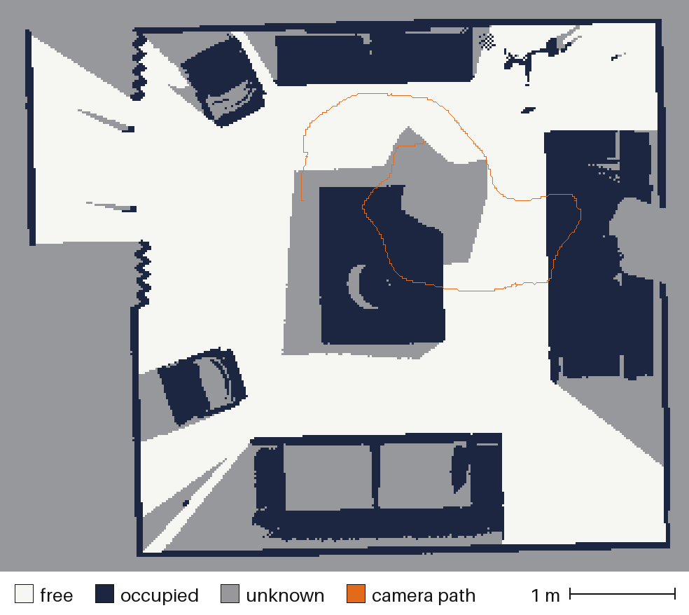

# Observed free space

A surface plan holds the blocks within a truncation of some measured depth.
A volume fused from it knows where surfaces are and nothing else: the
middle of a room and the far side of a wall are both simply absent. But
they are not the same. The scan looked through one and found it empty, and
never saw the other. A map meant for moving through a place has to tell
those apart.

<p align="center">
  
  
</p>

<p align="center">
  <em>The living room between 0.28 m and 0.86 m above its floor, at 20 mm.
  Left, from the surface plan's volume;<br>right, from the same plan
  expanded. Pale is free, dark is occupied, grey is unknown. The orange
  line is the camera's path.</em>
</p>

```powershell
python -m spatialforge reconstruct tsdf-block-plan-expand `
  scan.sftplan scan.vgsession scan-free.sftplan
```

Expansion writes a new plan holding every block of the old one and every
block that holds a voxel some frame observed. Fuse and mesh it like any
other plan.

## The rule

A voxel is observed by a frame if fusion would give it a contribution from
that frame: it projects into the image, in front of the camera, onto a
pixel with a valid depth, and lies no more than a truncation behind that
depth. A block is added if it holds one such voxel.

That is asked directly. Take a box of candidate blocks that contains every
voxel that could be observed, run the fusion evaluator over the box one
frame at a time, and keep one bit per block: did anything land. The verdict
is fusion's because it is fusion's code that gives it. Blocks behind the
camera or outside the image are settled eight corners at a time, as in
fusion, and a block that already has its bit is not looked at again.

### The box

A block could be missed without any sign if the box were too small, so its
size is derived.

A voxel observed through pixel `p` at depth `z` has `z ≤ m + truncation`,
where `m` is the depth measured at `p`. In the camera's frame its position
is `(z / m) s + z e`. Here `s` is the surface sample the planner
back-projected for `p`, through the centre of the pixel, and `e` is a
sideways offset of at most half a pixel at unit depth. So the voxel lies
within

```text
truncation × |r|  +  (m + truncation) × |half a pixel|
```

of the segment from the camera centre to `s`, where `r` is the longest ray
of the image scaled to unit depth. `s` is inside a planned block, and `m`
is no more than the distance from the camera to it. The box that spans the
planned blocks and the camera centres, grown by that margin with `m`
replaced by the box's own diagonal, therefore contains every observed
voxel.

For the living room at 20 mm the margin is 91 mm, less than one 160 mm
block, and the box is 30,960 blocks.

## Two rules, and how they relate

There was already a path that expands a plan. It gets there in stages that
are each easy to believe: cover every pixel's wedge with blocks, resolve
every voxel of that cover against every frame, approve the covered blocks
that hold an observed voxel. Each stage keeps an outcome per pixel or per
voxel and stops at 262,144 of them. One 640×480 frame is more than that, so
it has only ever run on a fixture two pixels wide. It remains as a
reference.

It is not the same rule. Its wedge runs from the camera to the measured
surface and stops there. Fusion goes on writing for a truncation behind the
surface. A block that holds only voxels in that last stretch, and that the
planner's halo happened not to reach, is added by the rule on this page and
not by the reference.

A plan records which rule made it, and the loader refuses one rule's
`free_space_rule` beside the other's `approval_rule`:

| | `free_space_rule` | `approval_rule` |
|---|---|---|
| reference | `conservative-nearest-pixel-footprint` | `covered-block-with-at-least-one-observed-voxel` |
| this page | `every-block-with-an-observed-voxel` | `block-with-at-least-one-observed-voxel` |

The relation between them is tested on the seven cases the reference can
run, and holds on every one:

- the reference never approves a block this rule does not;
- every block with an observed voxel in front of the surface is in both;
- whatever this rule adds beyond the reference holds only voxels behind
  the surface.

On six of the seven the two plans hold the same blocks. They differ on the
one where a single pixel is three metres wide where it meets the surface:
176 blocks against 161. With a real camera's pixels, a few millimetres
wide, the stretch behind the surface that the reference leaves out should
lie almost entirely inside the planner's halo already. That is not
measured: the reference cannot run on a real frame.

## What was checked

- **The verdict on each block.** A second implementation, written in the
  test and sharing no code with the fusion evaluator, rules on every block
  of the box: on the seven fixture cases, and on a 20-frame room scan the
  reference cannot take. The two agree on every block.
- **The box.** Grown by two more blocks in every direction, it finds
  nothing more. The margin itself is tested by building 4,000 of the worst
  cases the argument allows, voxels at the corners of a pixel's square at
  the far end of the band, and measuring each against it. The worst uses
  83% of the margin.
- **Closure.** Fusing the expanded plan puts something in every block that
  was added, and would put nothing in any block that was left out.
- **No effect on what was there.** Blocks the plan already had are fused
  to the same bytes.

## On the living room

ICL-NUIM `lr kt2`, 440 frames, at two voxel sizes with a truncation of
three voxels:

```text
                             20 mm                        10 mm
                  surface plan    expanded     surface plan      expanded
blocks                   7,655      17,394           27,965       122,688
observed voxels      2,520,109   7,206,954        8,890,488    55,598,462
contributions      188,387,632 626,372,579      657,800,997 4,877,187,683
expand                                64 s                          166 s
fuse                      54 s       130 s            211 s         842 s
volume                   47 MB      107 MB           172 MB        755 MB
```

**The mesh barely changes, and at 20 mm not at all.** The mesh extracted
from the 20 mm expanded volume has the same 911,173 vertices and 1,796,756
triangles as the one from the surface plan's volume, byte for byte. The
two files differ in one header line, the digest of the volume each came
from, and the accuracy and completeness figures are the same figures.

At 10 mm it is the same mesh with 118 triangles added to 7,237,866. None
is removed and none moves. The 118 come to 4.5 cm² in all, 106 of them
in a column of five blocks up one vertical edge. Voxels the two volumes
share hold the same values, so these can only be cells that lacked a
corner: one whose neighbour lies in a block the surface plan never held.
With that block present the cell has all eight corners and is meshed. They
move the accuracy figures in the fourth digit: RMS 1.694 mm to 1.697 mm,
the median unchanged at 0.451 mm.

An earlier version of this page said free space adds no surface. That is
what the 20 mm room and the real desk show, and it is not a rule.

**The map does.** Over the band in the picture, 0.28 m to 0.86 m above the
floor:

| | Free | Occupied | Unknown |
|---|---|---|---|
| surface plan, 20 mm | 2.05 m² | 7.97 m² | 25.67 m² |
| expanded, 20 mm | **14.33 m²** | 7.97 m² | 13.38 m² |
| surface plan, 10 mm | 0.89 m² | 7.31 m² | 25.08 m² |
| expanded, 10 mm | **14.25 m²** | 7.31 m² | 11.72 m² |

A column is free only if every voxel of it in the band was observed, at
least three times, and lies in front of every surface seen. It is occupied
if any voxel in the band is at or behind a surface. At each voxel size the
occupied area is the same with and without free space, because the
surfaces are.

**Every camera was somewhere the volume calls free.** The voxel at each of
the 880 camera positions is observed free space in the expanded volume, at
20 mm and at 10 mm: 880 free, none unseen, none behind a surface. No
camera position was used
to mark anything free. Free space comes only from the depth rays of the
frames, so this is other frames having looked through the place where each
camera stood. In the surface plan's volume all 880 are unseen.

The picture is drawn by
[`tools/free_space_map.py`](../tools/free_space_map.py):

```bash
python tools/free_space_map.py \
  datasets/icl-kt2-20mm-free.sftvol docs/assets/icl-room-free-space.png \
  --from-m -0.9 --to-m -0.3 --session datasets/icl-kt2.vgsession
```

The scan's floor is at −1.17 m in its own frame, which is where the band's
heights above the floor come from.

## On a real sensor

TUM `freiburg1_xyz`, a real Kinect over a desk, 395 frames fused, 15 mm
voxels:

```text
                        surface plan      expanded
blocks                         5,401         8,692
observed voxels            1,492,894     2,678,995
contributions applied     66,200,108   100,644,932
```

**The mesh does not change here either.** 279,979 vertices and 535,486
triangles, the same arrays. The held-out residual is the same to a
thousandth of a millimetre, 7.518 mm at the median, with four more of
5.76 million held-out samples landing in observed voxels.

**No camera is behind a surface.** Of the 790 camera positions, the voxel is
observed free for 476 and unseen for 314, and behind a surface for none.
The unseen ones are the positions furthest back: none in the front third of
the path, two thirds of the rear third. This camera slides half a metre
along each axis and never turns round, so no frame looks back through the
places it retreated to.

At the cameras' height the expanded volume holds 1.39 m² as free where the
surface plan's holds 0.10 m², and 2.24 m² as occupied in both. It is a
desk seen from one side, not a room: 91% of that map is unknown, and no
picture of it is worth showing.

### What most of the box is

The box for this scan is 91,800 blocks around a plan of 5,401. A few far
depth readings stretch it to nearly eight metres, and almost all of it is
behind something. A block behind a wall is in the image and in front of the
camera, so the whole-block verdicts fusion uses do not settle it, and it was
evaluated voxel by voxel on every frame to find each time that nothing
lands.

A third verdict settles it from the depth image. If the nearest corner of a
block is more than a truncation behind the largest depth measured anywhere
in the rectangle of pixels the block projects into, no voxel of it can be
within a truncation of what its own pixel measured. The largest depth in a
rectangle is read from a table built once per frame.

| | Without | With |
|---|---|---|
| desk, 395 frames, 91,800 candidate blocks | 1,607 s | 148 s |
| living room, 440 frames, 30,960 candidate blocks | 74 s | 64 s |

The plans are the same plans, digest for digest. The verdict is tested
against the evaluator: no block it calls hidden receives a contribution.

## What it does not do

- **It is not a traversability map.** Free means observed empty over the
  band, at the time of the scan. Nothing here knows the size of whoever is
  moving, finds the floor, or says a gap is wide enough.
- **Unknown is the cautious answer and there is a lot of it.** One voxel
  of a column seen fewer than three times makes the column unknown. The
  grey around the table in the picture is space the camera passed over
  without looking down into.
- **Glass and mirrors are whatever the depth says they are.** A depth
  camera that sees through a window marks the window free.
- **There is a ceiling.** A plan holds at most 250,000 blocks and the
  candidate box at most 8,000,000. The living room at 10 mm needs 122,688,
  which was more than a plan could hold until the ceiling was raised from
  100,000. An expansion that passes the ceiling is refused at the frame
  where it does, not after the whole scan has been read. The box was held
  to 500,000 while every block of it was listed as approved or rejected;
  the command now counts the rejected ones and lists only what it
  approves, and writes the same plan.
- **Surface only glanced at is still lost.** Expansion adds free space. It
  does not bring back the [glancing-angle loss](icl-nuim-validation.md#what-is-missing-is-what-was-only-glanced-at).
