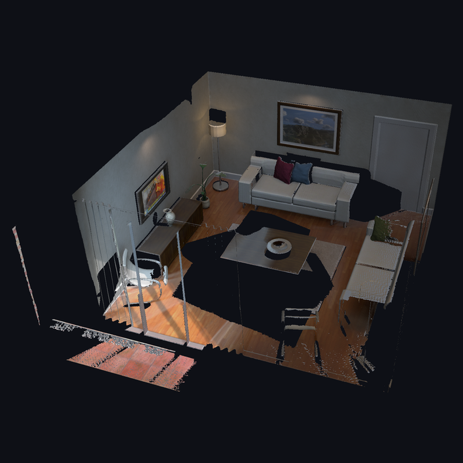
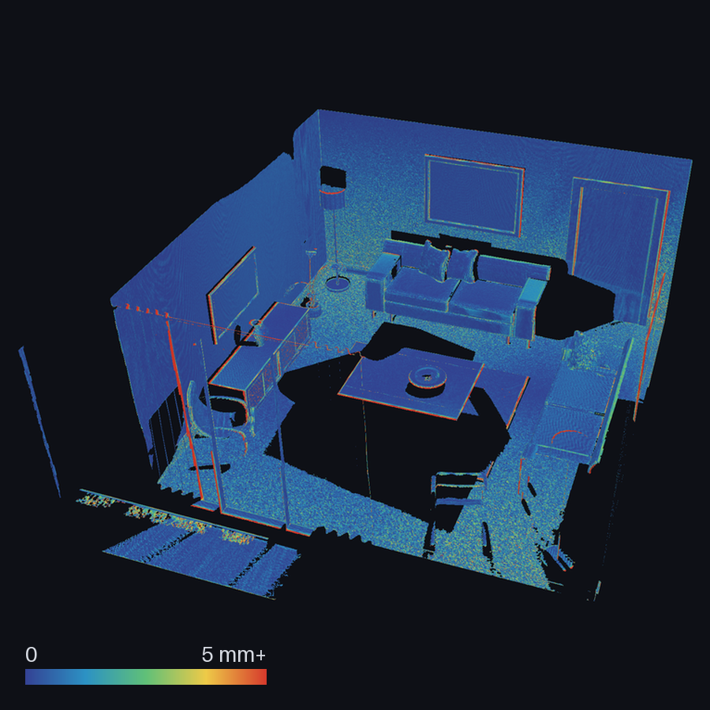
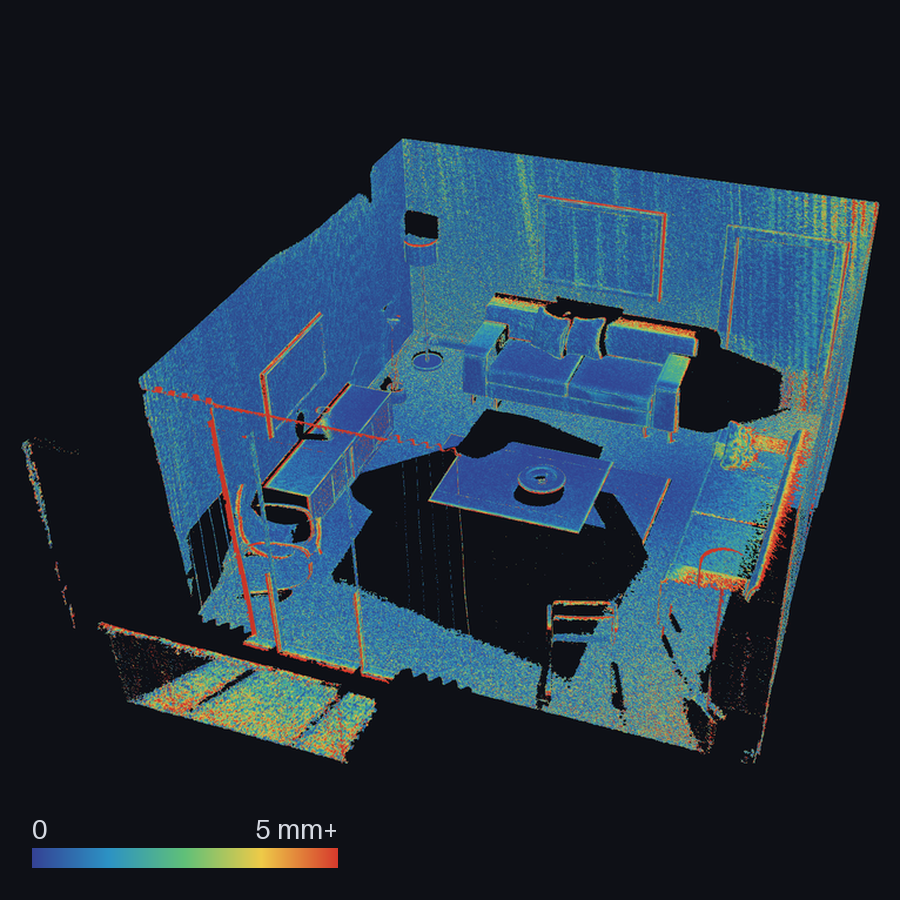
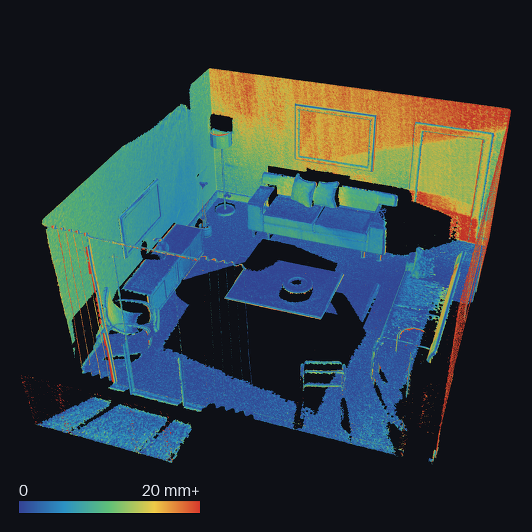

# Absolute accuracy: ICL-NUIM living room

The [TUM result](tum-validation.md) is agreement between views: a volume
fused from half the frames, checked against depth from the other half. It
cannot say how far the surface is from where the surface really is, because
TUM does not publish where the surface really is.

[ICL-NUIM](https://www.doc.ic.ac.uk/~ahanda/VaFRIC/iclnuim.html) does. Its
living room is a synthetic scene, rendered from a model that ships with the
dataset. This page measures the reconstructed mesh against that model.

<p align="center">
  
  
</p>

<p align="center">
  <em>Left: the room at 10 mm voxels, 7.2 million triangles, coloured from
  the scan. Right: the same mesh<br>coloured by its distance to the
  ground-truth surface, on a scale that saturates at 5 mm; 95% of it is
  under 2.4 mm.</em>
</p>

## What this isolates

The sequence is `living_room_traj2` ("lr kt2"), the noise-free variant: 880
posed frames at 640x480. The camera poses are the dataset's own and the
depth is exactly what the renderer computed.

So nothing here is a sensor and nothing is a tracker. What is left is the
engine: the voxel grid, the fusion rule, and the mesher. This is the error
SpatialForge adds to perfect input, and it is a floor under any real
result, not a forecast of one.

## Three things the dataset does not tell you

**It is left-handed.** The published intrinsics have `fy = -480`: the scene
was rendered by POV-Ray, whose camera y axis points up. Dropping the sign
and keeping the poses raises no error; it reconstructs the mirror image of
every frame, placed by poses that belong to the unmirrored one.
[`tools/prepare_icl_nuim.py`](../tools/prepare_icl_nuim.py) converts the
poses instead, `R' = F R S` and `t' = F t`, which for a unit quaternion is a
permutation of its components and one negated coordinate. The importer
refuses a negative focal length outright, so the shortcut is not available
by accident.

**What the files mean.** Depth is planar z, not distance along the ray, and
pose `k` belongs to image `k`, which leaves frame 0 without a pose. The
first is not written down with the data, and the second has to be taken
on trust from a trajectory with one row fewer than there are images. So
both were decided against the model:

| Reading of the files | Raw depth within 2 cm of the model | Median distance to its surface |
|---|---|---|
| planar depth, pose `k` with image `k` | 100% | 0.43 mm |
| planar depth, pose `k` with image `k-1` | 94% | 3.7 mm |
| ray distance, pose `k` with image `k` | 16% | 8.7 mm |

Each reading was given its own best-fit alignment first, so the table is
not an artefact of aligning with the first one. The second and third rows
were measured once, with a scratch script, while working this out; the
first is what the report tool reproduces.

**Where the model is.** The trajectory and the model are in different
frames and the transform between them is not published. The dataset's own
evaluation tool, [SurfReg](https://github.com/mp3guy/SurfReg), starts from
a fixed guess per trajectory and runs ICP on the reconstruction being
evaluated.

Aligning the thing you are measuring lets the alignment absorb part of its
error. Here the transform is one rigid motion fitted by point-to-plane
registration of the **raw depth images** to the model, never of the mesh:

```text
fitted to            93,574 depth samples from 44 frames
rotation             1.1758 degrees
translation          (-0.74539, +1.29978, -0.78788) m
last update          1.8e-9 m
```

The mesh is then judged in a frame it had no part in choosing. The test
suite checks the property directly: a mesh with every vertex moved 25 mm
must score worse, which is exactly what a fit to the mesh would undo.

## How it is measured

For every vertex of the mesh, the nearest of the model's 9,982,296 oriented
points is found, exactly. Two distances are reported.

**To that point.** This is the statistic SurfReg reports. It is an upper
bound on the distance to the true surface: the model's points lie on the
surface, but only every few millimetres, so a vertex sitting exactly on it
is still a few millimetres from the nearest one.

**To the tangent plane through that point**, along the model's normal. This
takes the sampling out, and is the figure to read.

Both have a floor, and it is measured rather than assumed. Depth from 44
frames the fit did not use is scored the same way. That is what a perfect
reconstruction would get under this alignment and this model.

The nearest-neighbour search is a uniform grid that is exact by
construction: a candidate is accepted only if it is no farther than one
cell, in which case nothing nearer can lie outside the 27 cells searched;
otherwise the query is retried on a grid twice as coarse. It is tested
against comparing every pair, to the index and to the last bit of the
distance.

## Results

440 frames fused (every second one), mesh filtered as on the TUM page:
voxels seen fewer than three times are unknown, fragments under 200
triangles are dropped.

Distance from each mesh vertex to the model's tangent plane:

| Voxel | Vertices | Median | Mean | RMS | p95 | p99 |
|---|---|---|---|---|---|---|
| 20 mm | 911,173 | 0.48 mm | 1.37 mm | 4.15 mm | 4.45 mm | 22.5 mm |
| 15 mm | 1,597,055 | 0.45 mm | 1.02 mm | 2.87 mm | 3.20 mm | 13.4 mm |
| 10 mm | 3,656,989 | **0.45 mm** | **0.77 mm** | **1.69 mm** | 2.34 mm | 6.5 mm |
| raw depth (floor) | 93,549 samples | 0.43 mm | 0.57 mm | 0.83 mm | 1.56 mm | 3.1 mm |

Distance to the nearest model point, the SurfReg statistic:

| Voxel | Mean | Median | Within 5 mm | Within 10 mm |
|---|---|---|---|---|
| 20 mm | 4.10 mm | 3.42 mm | 77.1% | 97.2% |
| 15 mm | 3.79 mm | 3.34 mm | 78.9% | 98.3% |
| 10 mm | 3.58 mm | 3.28 mm | 80.4% | 99.2% |
| raw depth (floor) | 3.42 mm | 3.21 mm | 82.3% | 99.9% |

No vertex of any of the three meshes is farther than 160 mm from the model;
the worst is 75 mm at 20 mm voxels and 35 mm at 10 mm.

Three readings.

**The median is the floor.** Half the surface is within 0.45 mm of the
model's planes, and raw depth, rendered from the same scene, scores
0.43 mm. At the median there is nothing left to measure: the reconstruction
is as close as this model and this alignment can tell.

**The mean is the tail.** As the voxel halves, RMS falls from 4.2 mm to
1.7 mm and p99 from 22.5 mm to 6.5 mm, while the median barely moves. The
error is not spread over the surface. It is concentrated, and the picture
at the top of this page shows where: along silhouette edges, where a thin
structure or an occlusion boundary is narrower than the truncation band,
and the surface either rounds off or carries a fringe past the edge.
Walls, floor and table tops stay at the low end of the scale. The floor is the more speckled:
at 10 mm its median is 0.53 mm against 0.47 mm for vertical surfaces,
but 28% of it is over a millimetre where 15% of the walls are.

**There is a small bias towards the camera.** The mean signed distance is
+0.33 mm at 10 mm, with the model's normals pointing into free space. Raw
depth shows +0.29 mm by itself, so most of it is already there before
anything is fused.

## The held-out residual, checked

The TUM page can only report a held-out TSDF residual and has to say that
it is not accuracy. Here both exist for the same volume, so one can be held
against the other:

| Voxel | Held-out residual, rms | Distance to truth, rms | Held-out median | Truth median |
|---|---|---|---|---|
| 20 mm | 3.63 mm | 4.15 mm | 0.40 mm | 0.48 mm |
| 15 mm | 2.52 mm | 2.87 mm | 0.38 mm | 0.45 mm |
| 10 mm | 1.50 mm | 1.69 mm | 0.36 mm | 0.45 mm |

The residual runs at 87 to 89% of the true error at every voxel size. They
are different measurements, of a volume in one case and a mesh in the
other, and one scene does not make a law. But on exact depth the number
TUM is limited to moves with the real one and slightly understates it.
With sensor noise the relation is very different, and
[the next section](#what-it-does-to-the-held-out-residual) measures it.

It also puts the TUM figure in context. The same engine that is 0.4 mm from
held-out depth here is 6.6 mm from it on the Kinect sequence (medians,
10 mm voxels both). The difference comes with the data: a real sensor,
its calibration, and measured poses.

## With a sensor's noise

Everything above is on exact depth. To see what a sensor costs, the same
sequence was given a Kinect's depth noise and reconstructed again: the same
scene, the same poses, the same ground truth, with only the depth changed.

The noise is the model the ICL-NUIM paper describes for its own noisy
sequences, its equation 3. Each pixel reads the true depth a fraction of a
pixel away from where it should; Gaussian noise is added in disparity; and
the disparity is rounded to a whole number, which quantises depth in steps
of 11 mm at 2 m and 26 mm at 3 m. A frame of it is a median 3.2 mm from
the true surface, where an exact frame is 0.43 mm.

It is simulated here, from a seed, by
[`tools/simulate_kinect_noise.py`](../tools/simulate_kinect_noise.py).
**It is not the dataset's published noisy sequence.** That is measured
[further down](#the-datasets-own-noisy-sequence), and it turns out to be a
different thing. The paper also displaces points along their normals by an
amount it gives no parameters for, and that step is left out here rather
than guessed.

<p align="center">
  
  
</p>

<p align="center">
  <em>Distance to the true surface at 10 mm voxels, on one scale. Left: from
  exact depth. Right: from depth<br>with a Kinect's noise simulated on it.
  The bands on the far walls are what quantised depth leaves behind.</em>
</p>

The noisy meshes are judged in the frame fitted on the exact sequence, not
in one fitted to their own depth. The report reuses the earlier alignment,
and refuses to unless the model and the source trajectory are the same by
digest. Here it would have mattered little: fitted to the noisy depth
instead, the frame moves by at most 0.6 mm anywhere in the room, and the
10 mm median reads 0.88 mm rather than 0.86.

Distance to the model's tangent plane:

| | Median | Mean | RMS | p95 |
|---|---|---|---|---|
| one noisy depth frame | 3.16 mm | 5.28 mm | 8.97 mm | 16.91 mm |
| mesh from noisy depth, 20 mm voxels | 0.81 mm | 1.89 mm | 4.87 mm | 5.92 mm |
| mesh from noisy depth, 15 mm voxels | 0.77 mm | 1.63 mm | 3.82 mm | 5.02 mm |
| mesh from noisy depth, 10 mm voxels | **0.86 mm** | **1.55 mm** | **3.00 mm** | 4.87 mm |
| mesh from exact depth, 10 mm voxels | 0.45 mm | 0.77 mm | 1.69 mm | 2.34 mm |

**Fusion buys back most of the noise.** The 10 mm mesh is 3.7 times
closer to the truth than the depth it was made from at the median, and
3.0 times in RMS. Averaging many frames, up to 219 for one voxel here, is
the point of a TSDF, and this is what it is worth.

**What is left costs 0.4 mm.** At 10 mm the median goes from 0.45 mm on
exact depth to 0.86 mm on noisy depth, and the mean and RMS roughly
double. It has no direction: the mean signed error is +0.5, +0.3 and
-0.3 mm at the three voxel sizes.

**A finer grid no longer moves the median.** On exact depth the median sat
at the measurement floor at every voxel size. With noise it sits near
0.8 mm at every voxel size: 0.81, 0.77 and 0.86 mm. The likely reading is
that this is what is left of the noise after averaging, which is not the
grid's to fix. The tail still shrinks with the voxel, as it did before.

**Noise costs blocks.** A noisy surface is thicker. At 10 mm the plan holds
49,658 blocks where exact depth needs 27,965. That was more than storage
would allocate when this was first run, although the planner had accepted
it; the two limits are now one.

### What it does to the held-out residual

On exact depth the held-out residual ran just under the true error. With
noise it does not:

| Voxel | Held-out residual, median | True error, median | Held-out residual, rms | True error, rms |
|---|---|---|---|---|
| 20 mm | 5.00 mm | 0.81 mm | 10.70 mm | 4.87 mm |
| 15 mm | 4.75 mm | 0.77 mm | 9.72 mm | 3.82 mm |
| 10 mm | 4.46 mm | 0.86 mm | 8.17 mm | 3.00 mm |

The residual compares the volume with depth from held-out frames, and those
frames carry the sensor's noise in full. On a noisy sensor it mostly reads
the noise of a single frame, and the surface is several times closer to the
truth than the residual suggests: five to six times at the median here.

That is how to read the TUM figure. Its 7.5 mm median is of this kind, a
real Kinect's frames against a volume fused from other real frames. It says
the volume agrees with the sensor to within the sensor's noise. It does not
say the surface is 7.5 mm from where it should be, and this experiment is a
reason to think it is closer. How much closer TUM cannot say: it has no
ground truth, and real poses and calibration add errors that this
simulation does not have.

Each noisy volume has the same chain of digests as the exact ones, in
`../results/icl-nuim-lr-kt2-kinect-noise-*`: surface and held-out reports
for 20, 15 and 10 mm.

## The dataset's own noisy sequence

ICL-NUIM also publishes this trajectory with noise already applied,
`living_room_traj2n`. It went through the same pipeline and was judged in
the same frame.

Its trajectory file is the clean one printed again with different rounding:
878 of 880 rows differ, by at most 10 micrometres and 7 microradians. So
the two have different digests, and the alignment is reused after comparing
them pose by pose instead.

### What is in the files

[`tools/depth_noise_report.py`](../tools/depth_noise_report.py) compares a
noisy sequence with the exact one it came from, pixel by pixel, in
disparity:

| | Dataset's noisy files | Equation 3, simulated here |
|---|---|---|
| Distance from a noisy disparity to a whole number, median (0.25 if not quantised) | 0.022 | 0.003 |
| Disparity error in smooth regions, median | **+0.51 levels** | 0.00 levels |
| The same as depth, at 1.2 / 2.2 / 3.5 m | -3 / -7 / -17 mm | 0 / 0 / 0 mm |
| Depth error over all pixels, median | 10.0 mm | 4.6 mm |
| Pixels more than 100 mm out | 4.0% | 0.5% |
| Pixels with no depth | 0.55% | 0.04% |

The files are quantised on exactly the disparity levels the paper's
equation gives, with depth in centimetres. That settles the unit the paper
leaves out.

They are also half a level nearer the camera than the exact depth, in
smooth regions, at every range beyond a metre.
The equation as printed rounds to the nearest level, which leaves no
offset, and simulating it leaves none. Rounding up instead would leave
exactly this. What the dataset's generator did cannot be read from its
files; only what it produced can.

Half a level is 3 mm at 1.2 m and 17 mm at 3.5 m, and it has the same sign
in every frame.

### What it does to the reconstruction

Distance to the model's tangent plane. The last column is the mean with
its sign, positive on the camera's side of the true surface:

| | Median | Mean | RMS | p95 | Mean signed |
|---|---|---|---|---|---|
| one frame of the dataset's noisy depth | 7.66 mm | 10.90 mm | 16.42 mm | 57.53 mm | +9.64 mm |
| mesh from it, 20 mm voxels | 9.67 mm | 10.83 mm | 13.25 mm | 23.55 mm | +10.17 mm |
| mesh from it, 15 mm voxels | **9.27 mm** | 10.53 mm | 12.88 mm | 22.96 mm | **+9.82 mm** |
| mesh from simulated noise, 15 mm voxels | 0.77 mm | 1.63 mm | 3.82 mm | 5.02 mm | +0.27 mm |
| mesh from exact depth, 15 mm voxels | 0.45 mm | 1.02 mm | 2.87 mm | 3.20 mm | +0.40 mm |

<p align="center">
  
</p>

<p align="center">
  <em>The 15 mm mesh from the dataset's noisy depth, on a scale four times
  coarser than the maps above.<br>The error is not speckle. It grows
  smoothly with distance from the camera.</em>
</p>

**Averaging does not remove an offset.** With noise that has none, the mesh
was about four times closer to the truth than a single frame. Here it is no
closer: a frame is 7.7 mm out at the median and the mesh 9.3 to 9.7 mm. The
signed column says why. The surface sits 10 mm on the camera's side of the
truth, which is the half level, carried through fusion intact.

**The error has the offset's shape.** Binning the 15 mm mesh's vertices by
distance to the nearest camera, the median error rises from 5 mm within a
metre to 22 mm beyond 3.5 m. The mesh from simulated noise goes from 0.5 to
1.6 mm over the same bins. (Measured once from the per-vertex errors; the
picture shows the same thing.)

**It is not that the noise is larger.** Over all pixels the dataset's noise
is about twice the simulated noise at the median, and the reconstruction is
twelve times worse: 9.3 mm against 0.77 mm. The difference is the offset.

**The held-out residual cannot see it.** Frames that are all wrong the same
way agree with each other:

| Depth, at 15 mm voxels | Held-out residual, median | True error, median | Ratio |
|---|---|---|---|
| exact | 0.38 mm | 0.45 mm | 0.8 |
| noise without offset, simulated | 4.75 mm | 0.77 mm | 6.2 |
| the dataset's noisy files | 7.02 mm | 9.27 mm | 0.8 |

On exact depth the residual ran just under the true error. With noise and
no offset it ran six times over. With an offset it runs under again, and
for the opposite reason: it never sees the part of the error every frame
shares. No fixed factor turns a held-out residual into accuracy, in either
direction, and that is the caveat the TUM page has carried from the start,
now with a measured example of each case.

**10 mm was refused.** The planner stops at 100,000 blocks and this
sequence needs more: its outliers scatter surface through the room, 41,455
blocks at 15 mm where exact depth needs 14,059.

**A fit to its own depth was refused too.** Asked to fit the alignment to
this sequence's own depth rather than reuse the exact one, the registration
was still moving by 39 micrometres a step when it stopped, and the report
declined to measure in a frame that had not settled.

The manifests are `../results/icl-nuim-lr-kt2n-*`.

## How much of what was seen is there

Everything above is accuracy: whether the surface that was built is in the
right place. A mesh of one square metre of wall, perfectly placed, would
score as well. The other question is how much of the surface the cameras
saw ended up in the mesh, and
[`tools/surface_completeness_report.py`](../tools/surface_completeness_report.py)
asks it from the model's side: for each point of the ground truth, is there
mesh nearby?

Two definitions carry the answer, so both are stated.

**Seen.** A model point is seen by a frame if it projects inside the image,
in front of the camera, on the side of the surface that faces it, and the
depth the frame measured at that pixel is the point's own depth to within
20 mm. The last condition separates sight from line of sight: a point
behind the sofa projects into the image too, and the depth there is the
sofa's. A point is observable if at least three fused frames saw it, which
is what the mesh asks of a voxel.

**Recovered.** The distance from the point to the mesh, measured exactly to
its triangles and not to their vertices, is within a threshold.

The model is placed by the alignment the accuracy report fitted, so the two
are readings in one frame. One model point in four is tested: 2,495,574
points, of which 515,430 (20.7%) are observable. The model is the whole
room, and the other 79% of its points are surface this trajectory did not
see three times; nothing is claimed about them. For the noisy sequences
sight is decided on the exact depth, so all eight meshes are held to the
same 515,430 points.

Of those, the share with mesh within each distance, and the share with none
within 30 mm:

| Depth | Voxel | 5 mm | 10 mm | 20 mm | None within 30 mm |
|---|---|---|---|---|---|
| exact | 20 mm | 89.7% | 92.8% | 97.2% | 2.0% |
| exact | 15 mm | 90.5% | 92.8% | 96.8% | 2.5% |
| exact | 10 mm | **93.3%** | 94.8% | **98.4%** | **1.1%** |
| simulated noise | 20 mm | 88.1% | 92.4% | 97.2% | 1.8% |
| simulated noise | 15 mm | 89.7% | 93.4% | 97.5% | 1.7% |
| simulated noise | 10 mm | 91.4% | 94.9% | 98.6% | 0.9% |
| the dataset's noisy files | 20 mm | 22.0% | 47.4% | 77.8% | 7.0% |
| the dataset's noisy files | 15 mm | 21.8% | 50.7% | 80.0% | 6.4% |

**Noise costs almost no coverage.** At 10 mm the mesh from simulated noise
has 91.4% of the seen surface within 5 mm where exact depth has 93.3%, and
as much of it within 20 mm.

**An offset reads as missing surface.** The dataset's noisy files put the
surface 10 mm on the camera's side of the truth, so only 22% of the true
surface has mesh within 5 mm. At a tight threshold completeness is accuracy
again, and the two should be read together.

### What is missing is what was only glanced at

On exact depth the 15 mm mesh lacks more of the seen surface than the 20 mm
one, which is not what a finer grid should do. So the report also records,
for each observable point, its most head-on view: the angle between the
surface normal and the direction to the camera, in the squarest frame that
saw it. The share with no mesh within 30 mm, on exact depth:

| Most head-on view | Points | 20 mm | 15 mm | 10 mm |
|---|---|---|---|---|
| within 60° of the normal | 334,139 | 0.3% | 0.1% | 0.1% |
| 60° to 70° | 124,157 | 0.5% | 0.1% | 0.0% |
| 70° to 75° | 22,081 | 3.1% | 1.5% | 0.6% |
| 75° to 80° | 13,491 | 7.0% | 10.2% | 1.1% |
| 80° to 85° | 13,195 | 36.0% | 49.2% | 17.4% |
| 85° to 90° | 8,367 | 26.0% | 51.9% | 32.8% |

Surface that some frame saw reasonably squarely is in the mesh. Surface
that every frame only glanced along is lost in bulk, at every voxel size.

The fusion rule says where that should begin. Signed distance here is a
difference in depth, the usual projective distance. Behind a surface met at
an angle θ from its normal, a truncation band therefore reaches only
`truncation × |r| × cos θ`, where `|r|` is the length of the
ray scaled to unit depth: 1 at the principal point and 1.30 in the corners
of this camera's image. When that is less than one voxel, the surface can
lie between voxel centres with none of them inside the band behind it. No
voxel records the negative side, and there is no sign change for a mesh to
be extracted from. The band is three voxels in every run here, so the angle
is 70.5° at the principal point and 75.1° in the corners. The loss in
the table begins in the 70° to 75° row.

Splitting the observable points at 70.5°:

| | Points | 5 mm | 20 mm | None within 30 mm |
|---|---|---|---|---|
| some frame saw it within 70.5°, 20 mm voxels | 461,665 | 92.2% | 98.9% | 0.40% |
| the same, 15 mm | 461,665 | 94.0% | 99.5% | 0.09% |
| the same, 10 mm | 461,665 | **95.3%** | **99.7%** | **0.05%** |
| every frame saw it more obliquely, 20 mm | 53,765 | 68.1% | 81.8% | 15.8% |
| the same, 15 mm | 53,765 | 60.3% | 73.4% | 23.3% |
| the same, 10 mm | 53,765 | 76.8% | 87.4% | 9.9% |

A tenth of the observable surface was only ever glanced at, and it holds
82% of what the 20 mm mesh is missing, 97% at 15 mm and 96% at 10 mm. Of
everything else, the 10 mm mesh lacks one point in two thousand.

It also accounts for the 15 mm row. Whether a glanced plane survives
depends on where it falls between voxel centres, and that changes with the
voxel size in no particular direction. This room's happen to sit worse in
the 15 mm grid than in the 20 mm one. (Looked at once and not in the
manifests: 69% of the points missing at 20 mm and 85% at 15 mm face
upwards, against 24% of all observable points, and they lie between the
floor and the camera, which was carried about a metre above it. Seats,
table tops and the tops of furniture, which a camera at that height can
only skim.)

The dataset's noisy files show the same loss and a second one. Of surface
seen within 60° of head-on, 5.5% has no mesh within 30 mm at 15 mm
voxels, where the other meshes lack 0.1 to 0.4%. That fits far wall being
in the mesh and more than 30 mm from where it belongs, as the error map
above shows, rather than not being there.

None of this is particular to this engine. It is the known weakness of a
projective signed distance. Widening the band trades it against accuracy,
as the next section measures. The remedy that avoids the trade is a
distance measured along the surface normal instead of along the ray, and
it is not implemented here.

An earlier version of this page also named a weight that falls with the
viewing angle. That was wrong. A weight changes how much an observation
counts, not whether a voxel behind the surface receives one, so it would
not bring this surface back.

The manifests are `../results/icl-nuim-lr-*-completeness.json`.

### Testing it: a wider band

If the band is what decides, widening it should move the loss to steeper
angles and leave everything else alone. The planner takes the truncation as
a parameter, so the room was reconstructed again, on exact depth, with bands
of four, six and eight voxels in place of three. The onset column is where
`acos(voxel / truncation)` puts it.

| Voxel | Band | Truncation | Onset | None within 30 mm | 75° to 80° | 80° to 85° | 85° to 90° |
|---|---|---|---|---|---|---|---|
| 20 mm | 3 voxels | 60 mm | 70.5° | 2.01% | 7.0% | 36.0% | 26.0% |
| 20 mm | 4 | 80 mm | 75.5° | 1.23% | 3.2% | 13.7% | 19.8% |
| 20 mm | 6 | 120 mm | 80.4° | 0.93% | 2.7% | 4.4% | 14.1% |
| 20 mm | 8 | 160 mm | 82.8° | 0.85% | 2.7% | 1.3% | 13.1% |
| 10 mm | 3 | 30 mm | 70.5° | 1.07% | 1.1% | 17.4% | 32.8% |
| 10 mm | 4 | 40 mm | 75.5° | 0.74% | 0.7% | 10.2% | 25.2% |
| 10 mm | 6 | 60 mm | 80.4° | **0.23%** | 0.5% | 1.6% | 8.0% |

**The loss moves where the band says.** At 20 mm, surface seen between 75°
and 80° loses 7.0% with the onset at 70.5° and 3.2% once it has passed
75.5°. Between 80° and 85° it loses 36%, then 13.7%, then 4.4% once the
onset has passed 80.4°, and 1.3% at 82.8°. Surface seen more squarely than
70° barely changes at any width.

It is paid for in accuracy, and in one place:

| Voxel | Band | Truncation | Median | Mean | RMS | p95 | p99 |
|---|---|---|---|---|---|---|---|
| 20 mm | 3 voxels | 60 mm | 0.48 mm | 1.37 mm | 4.15 mm | 4.45 mm | 22.5 mm |
| 20 mm | 4 | 80 mm | 0.49 mm | 1.88 mm | 6.29 mm | 6.67 mm | 34.8 mm |
| 20 mm | 6 | 120 mm | 0.50 mm | 3.20 mm | 11.43 mm | 15.63 mm | 63.7 mm |
| 20 mm | 8 | 160 mm | 0.52 mm | 4.64 mm | 16.31 mm | 28.03 mm | 91.9 mm |
| 10 mm | 3 | 30 mm | 0.45 mm | 0.77 mm | 1.69 mm | 2.34 mm | 6.5 mm |
| 10 mm | 4 | 40 mm | 0.45 mm | 0.92 mm | 2.50 mm | 2.68 mm | 12.1 mm |
| 10 mm | 6 | 60 mm | 0.46 mm | 1.38 mm | 4.54 mm | 3.94 mm | 26.3 mm |

**The median does not move and the tail grows with the truncation.** Half
the surface stays within half a millimetre at every width. RMS goes from
4.2 mm to 16.3 mm as the truncation goes from 60 mm to 160 mm, and p99 from
22 mm to 92 mm. The error maps above put the tail on silhouette edges, and a
wider band presumably reaches further past each one; that part was not
examined.

**The two follow different units.** The tail follows the truncation in
millimetres: 10 mm voxels with a six-voxel band and 20 mm voxels with a
three-voxel band share a 60 mm truncation and have nearly the same tail,
4.54 mm and 4.15 mm RMS. The loss follows the band in voxels: those same
two lose 0.23% and 2.01% of the seen surface.

So three voxels, which every other result on this page uses, is a choice
that favours accuracy, and it is not the only defensible one. A map that
must not lose table tops can have them for a wider band and a heavier
tail, or for smaller voxels at the same truncation and about six times the
blocks: 44,341 against 7,655.

The manifests are `../results/icl-nuim-lr-kt2-*-band*-*.json`.

## One chain per volume

Each volume is planned, fused, written, meshed and scored, and each step
records the digest of what it was given. For the 10 mm reconstruction:

| Artifact | SHA-256 |
|---|---|
| Scan (replay digest) | `c52207e9…86574593` |
| Block plan `.sftplan` | `876c6bcd…e762c6db` |
| Fused volume `.sftvol` | `e54492db…c7554788` |
| Mesh `.ply` | `017449f0…0cb358cf` |
| Ground-truth model | `414c0579…2be4279c` |

The full values, the fitted transform, the commit and the state of the
working tree are in
[`../results/icl-nuim-lr-kt2-10mm-surface.json`](../results/icl-nuim-lr-kt2-10mm-surface.json),
with the held-out report and the completeness report for the same volume
beside it, and the same three for 15 mm and 20 mm.

## What was run

```text
source                 881 RGB-D frames, 880 poses
imported               880 frames, all with poses (frame 0, which has none, is left out)
camera                 640 x 480, fx = 481.2, fy = 480.0
selected / fused       440 / 440   (frame_stride 2)

                         20 mm         15 mm          10 mm
truncation               60 mm         45 mm          30 mm
planned blocks           7,655        14,059         27,965
observed voxels      2,520,109     4,238,805      8,890,488
voxel-observations   1.72e9        3.17e9         6.30e9
  of which applied   188,387,632   309,488,634    657,800,997
mesh triangles       1,796,756     3,153,732      7,237,866
```

## Cost

One laptop CPU core, NumPy, no GPU, at 10 mm:

```text
plan      440 frames                      83 s
fuse      6.3e9 voxel-observations       211 s
mesh      7,237,866 triangles             42 s
align     93,574 depth samples            46 s
measure   3,656,989 vertices              67 s
complete  515,430 model points           298 s
```

Of those 6.3 billion voxel-observations, 81% are of a voxel behind the
camera or outside the image: a camera inside a room has most of the
room behind it or beside it. Most of them are settled a whole block at
a time, without being evaluated and without changing a byte of the
result; see
[`vectorised-fusion.md`](vectorised-fusion.md#blocks-a-frame-cannot-see).
At 20 mm fusion takes 54 s with that test and 257 s without it.

## Reproduce it

Download `living_room_traj2_frei_png.tar.gz` and `living-room.ply.tar.gz`
from the dataset page and extract them.

```bash
# 1. Convert the left-handed sequence to a right-handed TUM folder
python tools/prepare_icl_nuim.py \
  datasets/icl/living_room_traj2 datasets/icl/icl-nuim-living-room-kt2
```

```bash
# 2. Import it with the dataset's camera
python -m spatialforge scan import-tum \
  datasets/icl/icl-nuim-living-room-kt2 datasets/icl-kt2.vgsession \
  --fx 481.2 --fy 480 --cx 319.5 --cy 239.5
```

```bash
# 3. Plan, fuse and mesh
python -m spatialforge reconstruct tsdf-block-plan \
  datasets/icl-kt2.vgsession datasets/icl-kt2-10mm.sftplan \
  --voxel-size-m 0.01 --truncation-m 0.03 --frame-stride 2
```

```bash
python -m spatialforge reconstruct tsdf-block-volume \
  datasets/icl-kt2-10mm.sftplan datasets/icl-kt2.vgsession \
  datasets/icl-kt2-10mm.sftvol
```

```bash
python -m spatialforge reconstruct tsdf-block-volume-mesh \
  datasets/icl-kt2-10mm.sftvol datasets/icl-kt2-10mm.ply \
  --min-weight 3 --min-component-triangles 200
```

```bash
# 4. Measure it against the model
python tools/surface_accuracy_report.py \
  datasets/icl-kt2.vgsession datasets/icl-kt2-10mm.sftvol \
  datasets/icl-kt2-10mm.ply datasets/icl/model/living-room.ply \
  --initial-translation -0.75 1.30 -0.79 \
  --errors-out datasets/icl-kt2-10mm-errors.npy
```

```bash
# 4b. The same again with a Kinect's noise: simulate it, then import,
#     plan, fuse and mesh as above, and judge it in the frame step 4
#     fitted by handing that step's manifest to --alignment
python tools/simulate_kinect_noise.py \
  datasets/icl/icl-nuim-living-room-kt2 \
  datasets/icl/icl-nuim-living-room-kt2-kinect --seed 0
```

```bash
python tools/surface_accuracy_report.py \
  datasets/icl-kt2-kinect.vgsession datasets/icl-kt2-kinect-10mm.sftvol \
  datasets/icl-kt2-kinect-10mm.ply datasets/icl/model/living-room.ply \
  --alignment results/icl-nuim-lr-kt2-10mm-surface.json
```

```bash
# 4c. The dataset's own noisy sequence: prepare, import, plan, fuse and
#     mesh living_room_traj2n the same way, see what its depth contains,
#     and judge it in the exact sequence's frame. Its trajectory is the
#     same motion with different rounding, so name the earlier session
python tools/depth_noise_report.py \
  datasets/icl/icl-nuim-living-room-kt2 \
  datasets/icl/icl-nuim-living-room-kt2n
```

```bash
python tools/surface_accuracy_report.py \
  datasets/icl-kt2n.vgsession datasets/icl-kt2n-15mm.sftvol \
  datasets/icl-kt2n-15mm.ply datasets/icl/model/living-room.ply \
  --alignment results/icl-nuim-lr-kt2-10mm-surface.json \
  --alignment-session datasets/icl-kt2.vgsession
```

```bash
# 4d. How much of what was seen is in the mesh, in the frame step 4
#     fitted. For a noisy sequence add
#     --visibility-session datasets/icl-kt2.vgsession, so that what
#     was seen is decided on the exact depth
python tools/surface_completeness_report.py \
  datasets/icl-kt2.vgsession datasets/icl-kt2-10mm.sftvol \
  datasets/icl-kt2-10mm.ply datasets/icl/model/living-room.ply \
  --alignment results/icl-nuim-lr-kt2-10mm-surface.json
```

```bash
# 5. Draw where the error is
python tools/render_mesh.py datasets/icl-kt2-10mm.ply datasets/icl-error \
  --vertex-errors datasets/icl-kt2-10mm-errors.npy --error-scale-mm 5 \
  --cull-back-faces --azimuth 200 --elevation 35
```

```bash
# 6. Or the scan's colour and the error side by side, one camera for both
python tools/render_mesh.py datasets/icl-kt2-10mm.ply datasets/icl-both \
  --session datasets/icl-kt2.vgsession \
  --vertex-errors datasets/icl-kt2-10mm-errors.npy --error-scale-mm 5 \
  --cull-back-faces --azimuth 200 --elevation 35 \
  --size 560 --frames 24 --sweep 24
```

The initial translation is where the trajectory's origin sits in the
model's frame, to the nearest few centimetres. It came from a coarse search
(the floor height from a histogram, the rest from correlating top-down
occupancy) and the fit does not depend on it. Started 8 cm away in two
opposite directions, it returns the same transform to fifteen significant
digits and the same statistics.

## What this does not show

- **A real sensor.** The noise section simulates one published model of
  a Kinect: shifted readings, disparity noise and quantisation. It has
  no missing returns, no fringing at edges, no rolling shutter and no
  calibration error. The dataset's own noisy sequence adds an offset and
  outliers, and is still a simulation.
- **Pose error.** Poses are ground truth. The engine has no tracker.
- **Surface no frame saw.** Completeness is of what at least three fused
  frames saw. The other 79% of the model's points are outside it, and
  this trajectory leaves holes: the black patches in the pictures above
  are floor and furniture no frame looked at.
- **What counts as seen is a definition.** Three views and a 20 mm depth
  tolerance decide it. Other choices give another denominator.
- **Comparison with published numbers.** Figures quoted for SLAM systems on
  ICL-NUIM include tracking drift and are usually on the noisy sequences
  after aligning the reconstruction to the model. These are not the same
  experiment and should not be set beside them.
- **Another scene.** One room, one trajectory.
- **Mesh filters are choices.** Dropping fragments under 200 triangles
  removes 12,030 of 7.2 million triangles at 10 mm. The volume is
  unaffected.
